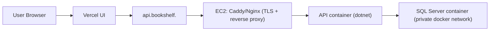

# Deployment Plan: Minimal Terraform on AWS (Lean + Cheap)

## Goal
Deploy a low-cost production-like setup for this side project:
- UI hosted on Vercel.
- API + SQL Server hosted on AWS.
- Infrastructure managed with Terraform.
- Keep monthly cost and operational overhead as low as possible.

## Constraints From Current App
- API is ASP.NET Core 3.1 and uses SQL Server (EF Core `UseSqlServer`).
- API runs migrations at startup.
- Existing local stack already runs API + SQL Server in Docker.

Because SQL Server is required, the cheapest practical AWS option is typically:
- Single EC2 instance running Docker Compose (API + SQL Server + reverse proxy),
instead of RDS SQL Server + ECS/Fargate/ALB (significantly higher cost/complexity).

## Recommended Lean Architecture



## What Terraform Should Create (Minimal)
1. `aws_security_group` for EC2
- Allow `80/443` from internet.
- Allow `22` only from your IP (or skip SSH and use SSM only).
- Do not expose SQL port `1433` publicly.

2. `aws_iam_role` + `aws_iam_instance_profile`
- Attach `AmazonSSMManagedInstanceCore` (Session Manager access, no SSH required).
- Optional: S3 write policy for DB backups.
- Optional: SSM Parameter Store read for secrets.

3. `aws_instance` (single VM)
- x86 instance type (SQL Server Linux image needs x86).
- Start with small size (`t3.small` or `t3a.small`), monitor memory.
- Root volume: small `gp3` (for example 30-50 GB).
- `user_data` installs Docker/Compose and starts the stack.

4. `aws_eip` + association
- Stable public IP for DNS and Vercel API target.

5. (Optional but recommended) `aws_route53_record`
- `api.<your-domain>` A record to the EC2 EIP.

6. (Optional) `aws_ssm_parameter` / secret references
- Store JWT, DB password, email provider key, etc.
- Inject at deploy time to compose `.env`.

## What Terraform Should Not Create (for this phase)
- No custom VPC/NAT gateways.
- No ALB.
- No ECS/Fargate.
- No RDS SQL Server.

These are valid later, but not lean/cheap for this project stage.

## Runtime Design on EC2
Run three containers with Docker Compose:
1. `reverse-proxy` (Caddy preferred for simple automated TLS, or Nginx if certs handled separately)
2. `api`
3. `db` (SQL Server)

Notes:
- Keep DB only on internal docker network.
- Persist SQL data on EC2 volume (`/srv/bookshelf/sqlserver-data`).
- Keep `api` behind reverse proxy, do not expose container port directly to internet.

## Deployment Workflow (Simple)
1. Build API image in GitHub Actions (or locally) and push to GHCR/ECR.
2. On EC2, pull latest API image and run `docker compose up -d`.
3. Vercel env variable points UI to `https://api.<your-domain>/api`.

Initial low-friction choice:
- Use GHCR for image hosting (no extra AWS service setup required).

## Suggested Terraform Layout
```
infra/terraform/
  providers.tf
  versions.tf
  variables.tf
  main.tf
  outputs.tf
  user_data.sh.tmpl
  terraform.tfvars.example
```

Optional module split (can be deferred):
```
infra/terraform/modules/
  compute/
  iam/
  dns/
```

## Minimum Variables
- `aws_region`
- `project_name`
- `instance_type`
- `allowed_ssh_cidr` (if SSH enabled)
- `domain_name` (optional)
- `api_subdomain` (optional)
- `db_sa_password`
- `jwt_key`
- `jwt_issuer`
- `sendgrid_api_key` (or current email provider key)

## Cost Guardrails
1. Single instance only.
2. No NAT gateway.
3. No managed database initially.
4. Use smallest viable x86 instance and tune SQL memory.
5. Set AWS Budget alert (email at low threshold).
6. Optional: stop instance at night with EventBridge Scheduler if uptime is not needed 24/7.

## Estimated Monthly Cost (AWS, Lean Baseline)
Assumptions:
- Region: `us-east-1` (N. Virginia)
- Runtime: single EC2 instance, 24/7 (~730 hours/month), Docker stack on one host
- Storage: `gp3` root/data volume at 30-50 GB
- Networking: one public IPv4, one Route 53 hosted zone, low DNS query volume
- Excludes: domain registration, email provider, backups to S3, and paid data transfer beyond the free tier

Estimated line items:
- EC2 compute:
  - `t3a.small` at `$0.0188/hr` -> about `$13.72/mo`
  - `t3.small` at `$0.0209/hr` -> about `$15.26/mo`
- Public IPv4 address at `$0.005/hr` -> about `$3.65/mo`
- EBS `gp3` at `$0.08/GB-month`:
  - `30 GB` -> `$2.40/mo`
  - `50 GB` -> `$4.00/mo`
- Route 53 hosted zone: `$0.50/mo`
- Route 53 DNS queries (standard): `$0.40 per 1M` queries
  - Example: `100k` queries -> `$0.04/mo`
  - Example: `1M` queries -> `$0.40/mo`

Total estimated monthly baseline:
- `t3a.small` profile: about **`$20.31-$22.27/mo`**
- `t3.small` profile: about **`$21.85-$23.81/mo`**

Practical planning number: budget **`$25-$35/mo`** for this phase to absorb normal usage variation (logs, modest extra storage, occasional traffic spikes).

## Security Baseline (Minimal but Sane)
1. Use HTTPS at the reverse proxy.
2. Restrict SSH or use SSM only.
3. Keep secrets out of Git; use SSM/env injection.
4. Restrict API CORS to Vercel domain(s) once stable.
5. Enable automatic security updates on host.

## Operational Baseline
1. Configure Docker restart policy for containers.
2. Add simple healthcheck endpoint for API.
3. Store DB backups locally and optionally sync to S3 nightly.
4. Keep a one-command rollback path (`compose` with pinned image tags).

## Phased Build Plan

### Phase 1: Terraform Base (1-2 sessions)
- Create EC2, SG, IAM role/profile, EIP.
- Provision with cloud-init/user-data to install Docker.
- Output instance public IP and API base URL.

### Phase 2: App Runtime on EC2
- Add production compose file on host.
- Start API + SQL Server + reverse proxy.
- Confirm migrations run and API reachable.

### Phase 3: Domain + TLS
- Point `api.<domain>` to EIP (Route53 or external DNS).
- Enable TLS (Caddy/Let’s Encrypt).
- Update Vercel env to API URL.

### Phase 4: Hardening + Backups
- Tighten CORS to Vercel origins.
- Add backup job and retention policy.
- Add budget alert and basic logs.

## Explicit Tradeoffs
- This is intentionally not highly available.
- Instance failure means downtime until restore/redeploy.
- Single-host SQL Server is a cost-first decision.
- Suitable for hobby/side-project usage, not for strict production SLOs.

## Future Upgrade Path (When Needed)
1. Move DB from container to managed service.
2. Move API to ECS/App Runner.
3. Add ALB/WAF and multi-AZ architecture.
4. Add CI/CD-driven immutable deploys.
